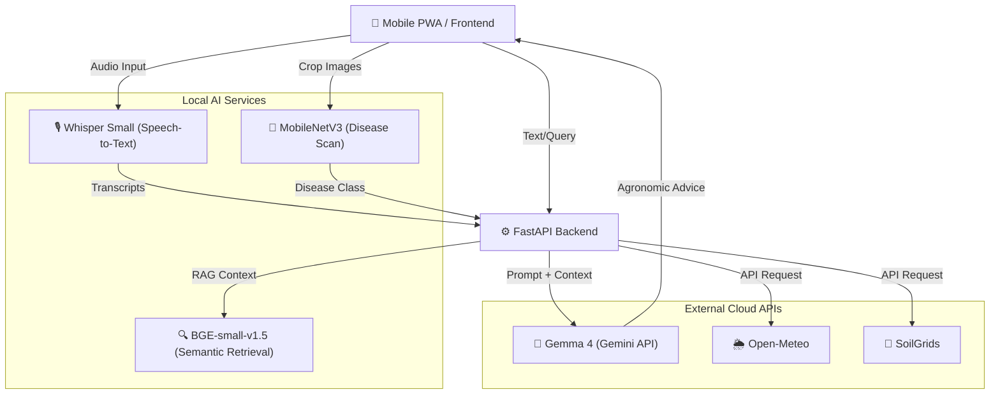

# 🌱 AgriBridge — India-Focused Agricultural Intelligence Platform

> **An advanced, India-focused agricultural software prototype combining edge-device computer vision, multilingual speech recognition, and Gemma 4 Multimodal AI for crop disease analysis and farm advisory.**

[](https://fastapi.tiangolo.com)
[](https://react.dev/)
[](https://deepmind.google/technologies/gemma/)
[](https://pytorch.org)
[](https://python.org)

---

**AgriBridge** is an experimental, mobile-first agricultural intelligence platform designed for Indian farmers. It bridges the gap between state-of-the-art AI models and local agricultural practices, providing an accessible interface for crop disease scanning, weather forecasting, carbon calculation, and multilingual agronomic advisory.

The platform unifies **Local Computer Vision (MobileNetV3)** for offline-capable disease detection, **Whisper Small** for speech-to-text input, **BGE-small-en-v1.5** for local semantic retrieval, and **Gemma 4** for high-quality, localized agricultural advice synthesis.

---

## 📋 Table of Contents

- [✨ Key Platform Capabilities](#-key-platform-capabilities)
- [🏗️ System Architecture & Pipelines](#️-system-architecture--pipelines)
- [🤖 Open Source Models & AI Integrations](#-open-source-models--ai-integrations)
- [🇮🇳 India Configuration](#-india-configuration)
- [🚀 Quick Start (Local Development)](#-quick-start-local-development)
- [📜 Documentation Index](#-documentation-index)

---

## ✨ Key Platform Capabilities

| Feature | Description | Core Technology |
|---|---|---|
| 🌿 **Edge Disease Classifier** | 15-class local crop disease scanning for tomato, potato, and bell pepper. Includes fail-closed OOD detection. | MobileNetV3-Small (ONNX) |
| 🗣️ **Multilingual Voice Advisory** | Local transcription of spoken queries enabling hands-free, multilingual interaction for farmers. | Whisper Small |
| 🤖 **Generative Agronomic AI** | Synthesizes post-scan precautions, avoidance steps, and follow-up guidance into clear, actionable advice. | Gemma 4 via Gemini API |
| 🌦️ **Environmental Adapters** | Integrates hyper-local weather and soil parameters to contextualize AI advice and farm conditions. | Open-Meteo & SoilGrids |
| 🌍 **Carbon Estimation Engine** | Illustrative calculations for farm-level carbon footprint and sequestration potential. | Parametric Estimator |
| 📱 **Offline-First Mobile PWA** | Progressive Web App architecture with IndexedDB caching ensures scans work even during intermittent connectivity. | React + Vite + Service Workers |

---

## 🏗️ System Architecture & Pipelines

The application follows a decoupled client-server architecture with heavy reliance on local edge inference where possible, falling back to cloud APIs only for advanced reasoning tasks.



---

## 🤖 Open Source Models & AI Integrations

AgriBridge is built on a foundation of powerful open-weights and API-accessible AI models:

- **Gemma 4 (`gemma-4-26b-a4b-it`)**: Hosted through the Gemini API. Used for advisory chat and synthesizing structured post-scan precautions, avoidance, and follow-up guidance based on local crop contexts.
- **Whisper Small (`Systran/faster-whisper-small`)**: Powers local backend audio transcription. Downloads weights on first use and ensures voice data is processed locally without third-party audio transmission.
- **BGE-small-en-v1.5**: Facilitates local semantic retrieval via FastEmbed's Qdrant ONNX export, matching farmer queries against our demonstration advisory corpus.
- **MobileNetV3-Small**: Fine-tuned 15-class local inference model (`imaflower/plantvillage-mobilenetv3`). Processes images entirely locally to detect diseases across tomatoes, potatoes, and bell peppers.

> **AI and Data Boundary Note:** Whisper and BGE run strictly locally. When configured, text prompts and retrieved contexts are sent to the Gemini API for Gemma 4 synthesis. Images are **never** uploaded to external APIs for guidance calls.

---

## 🇮🇳 India Configuration

The application is specifically tuned for Indian agricultural contexts, driven by `configs/countries/india.json`:

- **Languages Supported:** English, Hindi (हिंदी), and Bengali (বাংলা)
- **Primary Crops:** Tomato, Potato, Maize, and Bell Pepper
- **Default Geolocation:** Central India (Lat: 20.5937, Lon: 78.9629)

---

## 🚀 Quick Start (Local Development)

### 1. Configure the Gemma API
Copy `.env.example` to `.env` and add your `GEMINI_API_KEY`. Without this key, the system will gracefully fall back to local, pre-written cautious demo guidance.

### 2. Start the Backend Service
```bash
cd backend
python -m venv venv
# Windows: .\venv\Scripts\activate
# Linux/macOS: source venv/bin/activate

pip install -r requirements.txt
uvicorn app.main:app --reload --port 8000
```

### 3. Start the Frontend App
```bash
cd frontend
npm ci
npm run dev
```
Open `http://localhost:5173` in your browser.

### 4. Docker Alternative
```bash
docker-compose up --build
```

---

## 📜 Documentation Index

- [System Architecture](docs/ARCHITECTURE.md)
- [Data Sources & Third-Party Licenses](docs/DATA_LICENSES.md)
- [Evaluation & Validation Benchmarks](docs/EVALUATION.md)
- [Contributing Guidelines](CONTRIBUTING.md)
- [Code of Conduct](CODE_OF_CONDUCT.md)

> **Notice**: AgriBridge outputs are generated for demonstration and experimental purposes. Do not use outputs to make agronomic, financial, or compliance decisions without consulting local extension services.
