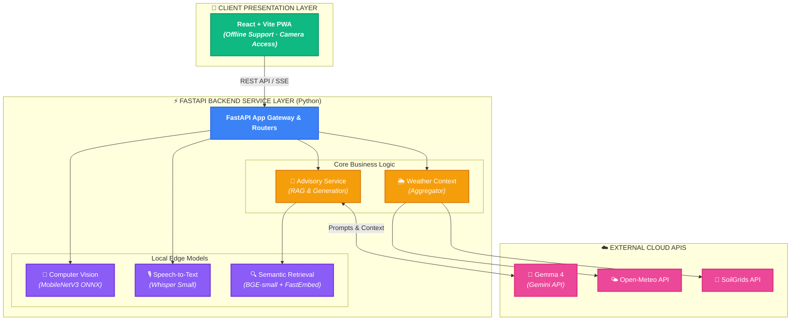
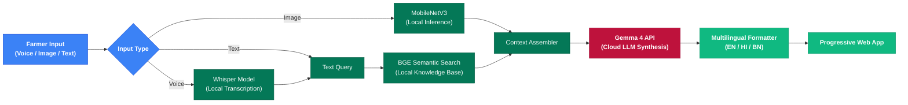

# 🌱 AgriBridge

> **An advanced, India-focused agricultural intelligence platform combining edge-device computer vision, multilingual speech recognition, and Multimodal AI for crop disease analysis and farm advisory.**

[](https://fastapi.tiangolo.com)
[](https://reactjs.org/)
[](https://vitejs.dev/)
[](https://python.org)
[](https://www.typescriptlang.org/)
[](https://onnxruntime.ai/)
[](https://huggingface.co/)
[](https://deepmind.google/technologies/gemma/)

---

AgriBridge is an experimental, mobile-first agricultural intelligence platform designed for smallholder farmers in India. It fuses **Local Computer Vision (MobileNetV3 / DINOv2)** for offline-capable crop disease scanning, **Multilingual Speech Recognition (Whisper)** for voice queries, **Dense Vector Retrieval (BGE-small)** for localized semantic search, and **Generative AI (Gemma 4)** to deliver personalized, actionable agronomic advice.

---

## 📋 Table of Contents

- [✨ Features](#-features)
- [🏗️ Architecture & Pipeline](#️-architecture--pipeline)
  - [System Architecture](#system-architecture)
  - [AI & Data Processing Flow](#ai--data-processing-flow)
- [🛠️ Tech Stack](#️-tech-stack)
- [🤖 Open Source Models & AI Integrations](#-open-source-models--ai-integrations)
- [🌍 Regional Context (India)](#-regional-context-india)
- [🔑 Environment Variables](#-environment-variables)
- [💻 Local Development Setup](#-local-development-setup)
- [🚀 Deployment](#-deployment)
- [📝 License](#-license)

---

## ✨ Features

| Feature | Details |
|---|---|
| 🌿 **Edge Disease Classifier** | 15-class local crop disease scanning for tomato, potato, and bell pepper using MobileNetV3 (ONNX). Includes fail-closed OOD detection. |
| 🗣️ **Multilingual Voice Advisory** | Local transcription of spoken queries (English, Hindi, Bengali) enabling hands-free interaction for farmers via Whisper Small. |
| 🤖 **Generative Agronomic AI** | Synthesizes post-scan precautions, avoidance steps, and follow-up guidance into clear, actionable advice using Gemma 4 via Gemini API. |
| 🌦️ **Environmental Adapters** | Integrates hyper-local weather (Open-Meteo) and soil parameters (SoilGrids) to contextualize AI advice based on exact farm coordinates. |
| 🌍 **Carbon Estimation Engine** | Illustrative calculations for farm-level carbon footprint and sequestration potential using localized parametric estimators. |
| 📱 **Offline-First Mobile PWA** | Progressive Web App architecture with IndexedDB caching ensures scans and basic queries work even during intermittent rural connectivity. |
| 🔒 **Privacy-First AI** | Voice transcription and initial vector embeddings run strictly locally. Images are processed on-device and never uploaded to cloud LLMs. |

---

## 🏗️ Architecture & Pipeline

### System Architecture



### AI & Data Processing Flow



---

## 🛠️ Tech Stack

| Component | Technology | Purpose |
|---|---|---|
| **Frontend Runtime** | React 18 + Vite | High-performance, reactive UI development |
| **Styling** | Tailwind CSS / Vanilla CSS | Responsive, mobile-first interface design |
| **Backend Framework** | FastAPI | Asynchronous Python REST API |
| **Inference Engine** | ONNX Runtime | High-speed local execution of vision models |
| **Vector Embeddings** | FastEmbed | Lightweight, local text embeddings for RAG |
| **Generative AI** | Google Gemini SDK | Interface for Gemma 4 synthesis and translation |

---

## 🤖 Open Source Models & AI Integrations

AgriBridge is built on a foundation of powerful open-weights and API-accessible AI models:

- **Gemma 4 (`gemma-4-26b-a4b-it`)**: Hosted through the Gemini API. Used for advisory chat and synthesizing structured post-scan precautions, avoidance, and follow-up guidance based on local crop contexts.
- **Whisper Small (`Systran/faster-whisper-small`)**: Powers local backend audio transcription. Downloads weights on first use and ensures voice data is processed locally without third-party audio transmission.
- **BGE-small-en-v1.5**: Facilitates local semantic retrieval via FastEmbed's Qdrant ONNX export, matching farmer queries against our demonstration advisory corpus.
- **MobileNetV3-Small**: Fine-tuned 15-class local inference model (`imaflower/plantvillage-mobilenetv3`). Processes images entirely locally to detect diseases across tomatoes, potatoes, and bell peppers.

> **Privacy Guardrail:** Whisper and BGE run strictly locally. When configured, text prompts and retrieved contexts are sent to the Gemini API for Gemma 4 synthesis. Images are **never** uploaded to external APIs for guidance calls.

---

## 🌍 Regional Context (India)

The application is specifically tuned for Indian agricultural contexts, driven by internal localization configurations:

- **Languages Supported:** English, Hindi (हिंदी), and Bengali (বাংলা)
- **Primary Crops Supported:** Tomato, Potato, Maize, and Bell Pepper
- **Default Geolocation Data:** Central India / Agrarian zones for fallback weather mapping.
- **Extension Services:** Direct routing recommendations to local Krishi Vigyan Kendras (KVKs).

---

## 🔑 Environment Variables

To run AgriBridge locally or in production, you must configure the following environment variables. Create a `.env` file in the root of the project:

```env
# Google Gen AI API Key (Required for Gemma 4 synthesis)
GEMINI_API_KEY=your_api_key_here

# Optional overrides for local model caching paths
# HUGGINGFACE_HUB_CACHE=./models/hf_cache
```

---

## 💻 Local Development Setup

### 1. Clone the Repository
```bash
git clone https://github.com/8ernity/AgriBridge.git
cd AgriBridge
```

### 2. Configure Environment
Copy the example environment file and add your API keys:
```bash
cp .env.example .env
```

### 3. Start the FastAPI Backend
```bash
cd backend
python -m venv venv
# Windows: .\venv\Scripts\activate
# Mac/Linux: source venv/bin/activate

pip install -r requirements.txt
uvicorn app.main:app --reload --port 8000
```
*Note: The backend will automatically download the ONNX models and HuggingFace weights on first launch.*

### 4. Start the React Frontend
Open a new terminal window:
```bash
cd frontend
npm ci
npm run dev
```
Navigate to `http://localhost:5173` in your browser.

---

## 🚀 Deployment

AgriBridge is designed to be easily deployed to PaaS providers like Render, Heroku, or Vercel.

**Render Deployment Strategy:**
1. **Frontend:** Deploy as a Static Site (Node/React). Build command: `npm run build`, Publish directory: `dist`.
2. **Backend:** Deploy as a Web Service (Python). Build command: `pip install -r requirements.txt`, Start command: `uvicorn app.main:app --host 0.0.0.0 --port $PORT`.

*Important: Ensure `GEMINI_API_KEY` is set in your host's environment variables.*

---

## 📝 License

This project is licensed under the MIT License - see the [LICENSE](LICENSE) file for details.

> **Notice**: AgriBridge outputs are generated for demonstration and experimental purposes. Do not use outputs to make agronomic, financial, or compliance decisions without consulting local extension services.
